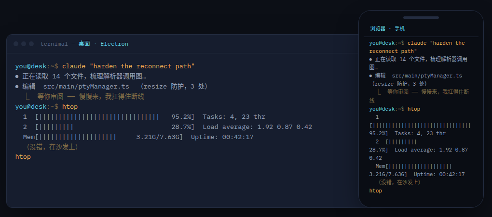
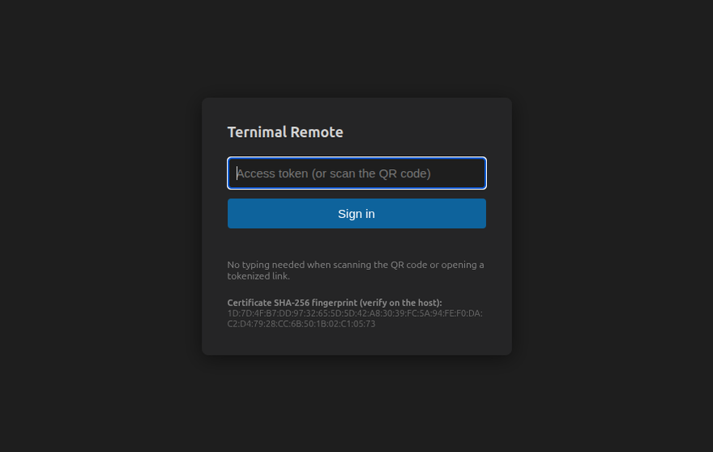
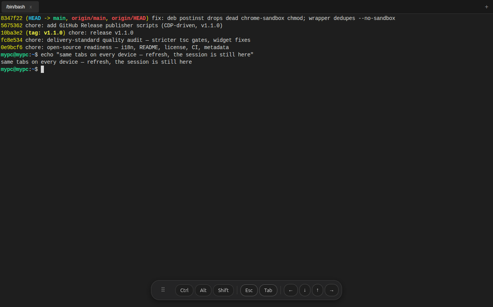
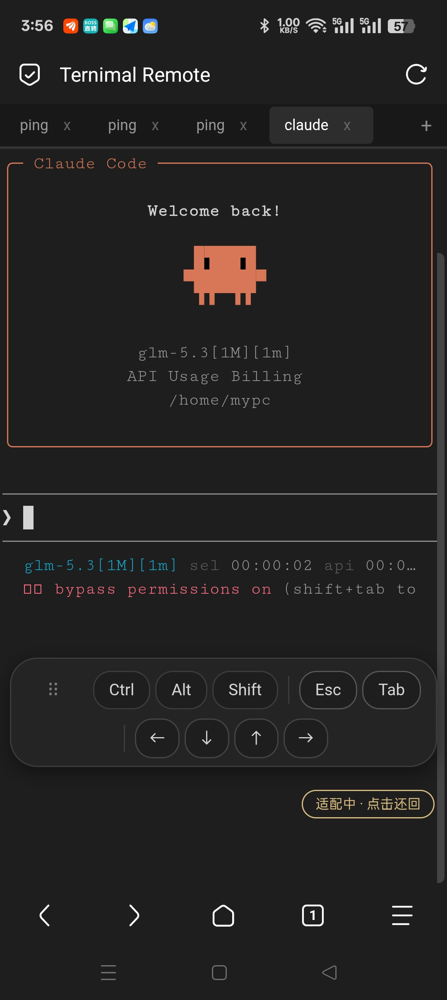
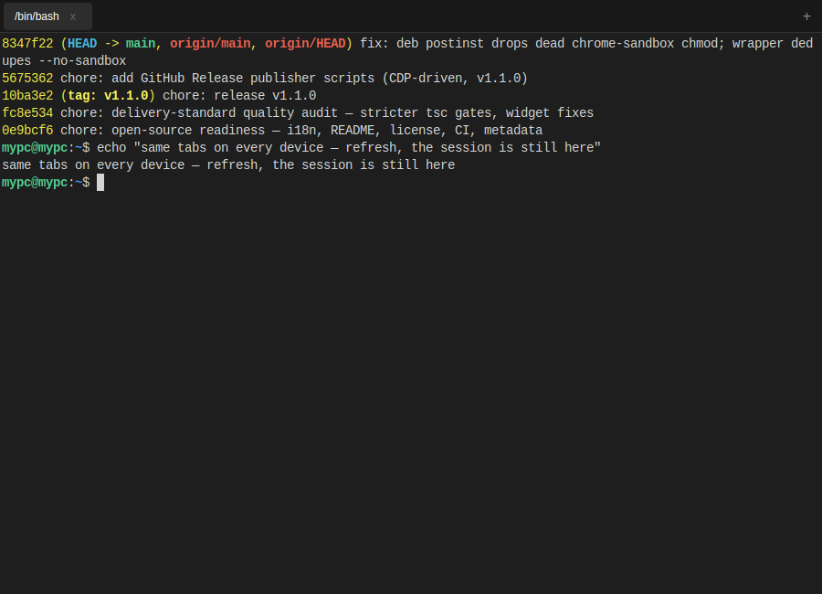

# Ternimal

<p align="center">
  <b>Multi-tab terminal that shares its sessions with any browser on your LAN — scan a QR code and your phone is attached to the same tabs the desktop shows.</b><br>
  <b>多标签终端：扫码即把桌面上的同一组标签共享给局域网内任意浏览器</b>
</p>

<p align="center">
  
</p>
<p align="center"><i>Same session, two screens: the desktop window and a phone browser are attached to the identical live PTY / 同一会话，双端所见：桌面窗口与手机浏览器挂在同一个活的 PTY 上</i></p>

<p align="center">
  <a href="#english">English</a> | <a href="#chinese">中文</a>
</p>

---

<a name="english"></a>
## English

### Overview

Ternimal is a standalone terminal emulator (xterm.js + node-pty, VS Code
terminal patterns) with a remote layer on top: a `SessionRegistry` in the
main process is the single source of truth, and both the local Electron
window and browser clients on the LAN/VPN attach to the **same PTY
sessions** over HTTPS. Sessions survive window close, page refresh and
network drops — a ring-buffer replay rehydrates scrollback on re-attach.

### The pain it removes

You start a long-running job — an AI agent refactoring a repo, a build, a
`docker build`, a training run — in a desktop terminal. Then you walk away.
Your options until now:

- **Stay at the desk** to babysit it.
- **SSH in from the phone** — which opens a *new* session, not the one that's
  already running. You see nothing of your scrollback, your tabs, your agent.
- **Share a tmux/screen session over SSH** — workable, but needs a client
  app, keys, a running sshd, and tmux discipline on every session.

Ternimal's answer: the sessions already live in the terminal you use —
**any browser on the LAN can attach to those exact sessions**, and they
survive every disconnect.

```text
   desktop (Electron)          phone / tablet / laptop (browser)
   ┌─────────────────┐         ┌───────────────┐
   │ tab1 ▸ claude   │◀──same──▶│  tab1 ▸ claude │   scan QR → in
   │ tab2 ▸ htop     │  PTYs   │  tab2 ▸ htop   │   refresh → replay
   └─────────────────┘         └───────────────┘
```

### Highlights

- **Scan-to-sign-in** — a per-launch 192-bit access token rides in the URL
  *fragment* (never sent to the server, never logged). The tray shows a QR
  code; the phone scans it and is in. Token rotates every launch, or on
  demand from the tray (kills all sessions instantly).

  <p align="center"></p>

- **Zero client install, shared sessions** — remote access is a plain HTTPS
  page; the local window and browsers stay consistent via the same tab list.

  <p align="center"></p>

- **Mobile soft keyboard** — draggable floating bar: sticky Ctrl/Alt/Shift
  (arbitrary combos, one-shot), Esc/Tab and ↑↓←→ keys that follow the
  terminal's cursor mode (DECCKM). `Ctrl+C`, readline meta-jumps and vim
  navigation work from a phone.

  <p align="center"></p>

- **Zero-knowledge relay networking** — reach a machine behind NAT/firewall
  from anywhere: self-host the relay (`relay/`, single-file Node, zero deps)
  or buy hosted access. Zero knowledge with end-to-end encryption on by
  default (the server only ever sees ciphertext); the master code is both
  identity and billing unit, subcodes expire/revocable; **one master = one
  live device** (intent-preempt on conflicts, ~30s auto-migration when you
  switch machines — no reconnect wars).

- **One-paste setup token** — for first-time buyers: issuing a master code
  in the admin page also mints a `tconf_v1_…` token (URL + master + CA
  cert, compressed). Paste it into the app's top card → preview → apply;
  no manual certificate files, no paths to fill.

- **Privacy-first networking** — self-signed TLS (SHA-256 fingerprint shown
  on both the sign-in page and the tray — anti-MITM), LAN/VPN only by
  design, per-IP rate limiting, `HttpOnly`+`Secure`+`SameSite=Strict`
  cookies, WS upgrade re-validation.
- **Engineering discipline** — 220+ automated assertions across 6 suites,
  including a real-Chrome end-to-end run.

### Use cases

- **Supervise AI agents from the couch** — Claude Code / Codex CLI running
  on the desktop; check in, send the next prompt or `Ctrl+C` a runaway task
  from your phone.
- **Ops without leaving bed (or the meeting)** — a server in the home lab /
  office LAN: start a migration at your desk, confirm it from any device.
- **Pairing on the LAN** — a colleague opens the link and watches the *same*
  live session you're driving; no screen-sharing software, no cloud.
- **Crash-proof mobile CLI** — subway Wi-Fi drops, the phone sleeps — the
  session keeps running; reconnect replays everything you missed.

### Local terminal features

| | |
|---|---|
| New / close / switch tab | `Ctrl+Shift+T` / `Ctrl+W` / `Ctrl+Tab` |
| Search / theme toggle | `Ctrl+Shift+F` / `Ctrl+Shift+L` |
| Rendering | WebGL with automatic DOM fallback, Unicode 11, truecolor |
| Platforms | Windows (ConPTY) / macOS / Linux (POSIX PTY) |

<p align="center"></p>

### Quick start

```bash
git clone https://github.com/eathard/vscode-ternimal.git
cd vscode-ternimal
npm install --include=dev   # dev tooling is required for builds
npm run rebuild             # native modules (node-pty) against Electron
npm run dev                 # build + launch
```

On first launch the app prints the access URL and shows the tray icon.
Tray menu → **Access info (QR code)** → scan with a phone → trust the
self-signed certificate (compare fingerprints if paranoid) → you are in.

### Verify everything

```bash
npm run verify                  # unit + protocol + reconnect + soft-keys
node scripts/smoke-e2e.mjs      # real Electron + real bash + TLS roundtrip
npm run verify:browser          # real Chrome end-to-end (needs google-chrome)
```

Suites print `N/M passed` and exit non-zero on failure — see
[docs/verification-standard.md](docs/verification-standard.md).

### Platform support

| Platform | Status |
|----------|--------|
| Linux (deb/AppImage) | ✅ verified end-to-end (development platform) |
| Windows | ⚠️ base terminal works (ConPTY paths); remote layer untested — reports welcome |
| macOS | ⚠️ untested |

`ws` and `node-pty` must stay webpack externals — bundling `ws` deadlocks
the Electron main loop (forensics: `docs/test-reports/` M2 §4).

### Security model — read before exposing this anywhere

Ternimal serves a **shell over the network**. That is the feature and the
risk. Mitigations: HTTPS-only, one dynamic token per launch (constant-time
compare, fragment-carried, instantly rotatable), dual fingerprint display,
per-IP lockout, hardened cookies. Sessions/auth are deliberately in-memory
— restarting revokes everything.

**Do not port-forward it to the internet.** LAN/VPN only; the boundary is
part of the design.

### Documentation

- [docs/remote-terminal-requirements.md](docs/remote-terminal-requirements.md) — requirements (with iteration history)
- [docs/technical-design.md](docs/technical-design.md) — architecture decisions
- [docs/final-delivery-report.md](docs/final-delivery-report.md) — delivery report + known limitations
- [docs/test-reports/](docs/test-reports/) — per-milestone verification reports
- Screenshots: [docs/images/](docs/images/) (release art) · [docs/test-reports/screenshots/](docs/test-reports/screenshots/) (verification captures)

### How it compares

| | Attach to the session on your screen | Client install | Sessions survive | Mobile combo keys | Cloud dependency |
|---|---|---|---|---|---|
| **Ternimal** | ✅ that's the point | browser only | built-in (replay) | sticky Ctrl/Alt/Shift + arrows | none |
| plain SSH from phone | ✗ new session | SSH client + keys | ✗ dies with the connection | varies | none |
| tmux + SSH app | needs tmux discipline | SSH client + keys | via tmux | varies | none |
| ttyd / wetty / gotty | ✗ new session per connect | browser | ✗ | ✗ | none |
| tunnel + web terminal | ✗ | browser | varies | ✗ | **yes** |

### Contributing

See [CONTRIBUTING.md](CONTRIBUTING.md). Short version: run the full verify
matrix before sending anything that touches the transport seam, the
registry, or the remote server.

---

<a name="chinese"></a>
## 中文

### 项目概述

Ternimal 是独立终端模拟器（xterm.js + node-pty，提取 VS Code 终端架构
模式），并在此之上叠加远程层：主进程的 `SessionRegistry` 是唯一事实源，
本地 Electron 窗口与局域网/VPN 内的浏览器客户端通过 HTTPS attach 到
**同一组 PTY 会话**。关窗口、刷新页面、断网全会话存活——重连时环形缓冲
重放恢复滚动历史。

### 它解决的痛点

你在桌面终端里启动了一个长任务——AI Agent 重构代码、一次构建、
`docker build`、一次训练——然后你离开了工位。过去的选择：

- **守在电脑前**盯着它跑；
- **手机 SSH 连回去**——那是开一个**新会话**，不是正在跑的那个：
  滚动历史、标签、Agent 进度全都看不见；
- **tmux/screen + SSH**——可行，但要装客户端、配密钥、跑 sshd，
  还得保证每个会话都在 tmux 里。

Ternimal 的答案：会话本来就活在你的终端里——**局域网内任意浏览器直接
attach 到这些会话**，断线多少次都活着。

### 特性亮点

- **扫码即登录** —— 每次启动生成 192bit 动态令牌，经 URL *片段* 携带
 （不抵达服务器、不进日志）；托盘出示二维码，手机一扫即入。令牌随启动
  轮换，也可托盘随时重置（即刻吊销全部会话）

  <p align="center"></p>

- **零客户端安装、会话共享** —— 远程端只是普通 HTTPS 页面；本地窗口与
  浏览器通过同一标签列表保持一致

  <p align="center"></p>

- **移动端软键盘** —— 可拖动悬浮条：Ctrl/Alt/Shift 粘滞组合（任意搭配、
  一次性复位）+ Esc/Tab + ↑↓←→（遵循 DECCKM 光标模式）。手机上 `Ctrl+C`、
  readline 元键跳词、vim 移动全可用

  <p align="center"></p>

- **零知识中继组网（跨网络远程）** —— 无公网 IP 也能从别处访问本机终端：
  自建中继（`relay/`，单文件 Node 零依赖）或购买托管服务。零知识 + 默认
  端到端加密（服务器只见密文）；主码=身份+计费，子码可定时吊销；
  **一码一机**（同主码冲突走意图抢占，换机 30 秒自动迁移，不产生互踢战争）

- **混合口令一键配置** —— 面向首购用户：卖家在管理页签发主码即得
  `tconf_v1_…` 混合口令（地址+主码+CA 证书的压缩编码），App 顶部粘贴框
  整条贴入 → 预览核对 → 一键应用，全程无需手动存证书/填路径

- **隐私优先组网** —— 自签名 TLS（SHA-256 指纹登录页与托盘双侧展示，
  防中间人）；仅内网/VPN（设计如此）；每 IP 限速；硬化 cookie；WS 升级复验
- **工程纪律** —— 6 套件 220+ 自动断言，含真 Chrome 端到端

### 使用场景

- **沙发监督 AI Agent** —— Claude Code / Codex CLI 在桌面跑着；手机随时
  查看、发下一条指令、`Ctrl+C` 掐掉跑偏的任务
- **躺床上做运维** —— 家里/办公室内网的服务器：工位上启动迁移，任何
  设备上确认结果
- **局域网结对** —— 同事打开链接就能看到你正在操作的**同一个**实时
  会话；无需屏幕共享软件，不经过云端
- **抗断线移动 CLI** —— 地铁 Wi-Fi 掉了、手机锁屏了——会话照跑；
  重连自动回放错过的全部输出

### 本地终端功能

| | |
|---|---|
| 新建 / 关闭 / 切换标签 | `Ctrl+Shift+T` / `Ctrl+W` / `Ctrl+Tab` |
| 搜索 / 主题切换 | `Ctrl+Shift+F` / `Ctrl+Shift+L` |
| 渲染 | WebGL 自动降级 DOM、Unicode 11、真彩色 |
| 平台 | Windows（ConPTY）/ macOS / Linux（POSIX PTY） |

<p align="center"></p>

### 快速开始

```bash
git clone https://github.com/eathard/vscode-ternimal.git
cd vscode-ternimal
npm install --include=dev   # 构建需要 dev 工具链
npm run rebuild             # 原生模块（node-pty）对齐 Electron
npm run dev                 # 构建 + 启动
```

首次启动打印访问 URL 并出现托盘图标。托盘菜单 → **查看访问信息（二维码）**
→ 手机扫码 → 信任自签名证书（谨慎可核对指纹）→ 进入终端。

### 全量验证

```bash
npm run verify                  # 单元 + 协议 + 重连 + 软键盘
node scripts/smoke-e2e.mjs      # 真实 Electron + 真 bash + TLS 往返
npm run verify:browser          # 真 Chrome 端到端（需系统 google-chrome）
```

套件打印 `N/M passed`，失败非零退出 —— 详见
[docs/verification-standard.md](docs/verification-standard.md)。

### 平台支持

| 平台 | 状态 |
|------|------|
| Linux（deb/AppImage） | ✅ 端到端验证（开发平台） |
| Windows | ⚠️ 本地终端可用（含 ConPTY）；远程层未实测，欢迎反馈 |
| macOS | ⚠️ 未实测 |

`ws` 与 `node-pty` 必须保持 webpack external —— 打包 `ws` 会死锁主事件
循环（取证见 `docs/test-reports/` M2 §4）。

### 安全模型 —— 暴露到任何网络前必读

Ternimal 把 **shell 搬上网络**，这既是功能也是风险。缓解：仅 HTTPS、
每次启动一个动态令牌（恒时比对、片段携带、可即刻轮换）、指纹双侧展示、
每 IP 锁定、硬化 cookie。会话与鉴权刻意只存内存——重启即吊销一切。

**不要端口转发到公网。** 仅限内网/VPN，这条边界是设计的一部分。

### 文档

- [docs/remote-terminal-requirements.md](docs/remote-terminal-requirements.md) —— 需求（含迭代史）
- [docs/technical-design.md](docs/technical-design.md) —— 架构决策
- [docs/final-delivery-report.md](docs/final-delivery-report.md) —— 交付报告 + 已知限制
- [docs/test-reports/](docs/test-reports/) —— 各里程碑验证报告
- 截图：[docs/images/](docs/images/)（README 配图） · [docs/test-reports/screenshots/](docs/test-reports/screenshots/)（验证留档）

### 横向对比

| | attach 到你屏幕上的会话 | 装客户端 | 会话存活 | 手机组合键 | 云依赖 |
|---|---|---|---|---|---|
| **Ternimal** | ✅ 核心能力 | 仅浏览器 | 内置（重放） | 粘滞 Ctrl/Alt/Shift + 方向键 | 无 |
| 手机直连 SSH | ✗ 新会话 | SSH 客户端+密钥 | ✗ 随连接断开死亡 | 参差 | 无 |
| tmux + SSH 应用 | 需 tmux 纪律 | SSH 客户端+密钥 | 靠 tmux | 参差 | 无 |
| ttyd / wetty / gotty | ✗ 一连一新会话 | 浏览器 | ✗ | ✗ | 无 |
| 内网穿透 + web 终端 | ✗ | 浏览器 | 不定 | ✗ | **有** |

### 参与贡献

见 [CONTRIBUTING.md](CONTRIBUTING.md)。一句话版：凡触碰传输缝、注册表或
远程服务器的改动，先跑全量验证矩阵。

---

## Acknowledgments / 致谢

This project is inspired by and extracts patterns from the [Visual Studio Code](https://github.com/microsoft/vscode) terminal implementation.
本项目灵感来源于并从 [Visual Studio Code](https://github.com/microsoft/vscode) 终端实现中提取模式。

## License / 许可证

[MIT](LICENSE)

## 多实例（方案 B）

一台机器可并行运行多个相互隔离的 Ternimal 实例（各自配置、证书、中继主码、端口）：

```bash
# 第二个实例（id 自取，字母数字-_，≤32 字符）
npx electron . --no-sandbox --ternimal-instance=work
# 或环境变量：TERNIMAL_INSTANCE=work
```

- **配置独立**：`<userData>/instances/<id>/config/config.json`（首次从默认配置克隆，但**中继置为关闭**——双实例须各自填独立主码再启用，防同主码在 relay 侧互相接管）；
- **配色对应**：实例 id 哈希 → 固定配色；顶部标签栏背景/强调线与**托盘图标染色**同源同色，窗口标题带实例标签，多实例一眼可辨；
- **端口共存**：配置端口被占（多为另一实例）自动回退随机端口，启动不失败；
- **中继共存**：不同主码 = 不同通道，双实例同时在线互不干扰（`verify-multi-instance` 5/5 验证）。

验证：`npm run verify:instances`
